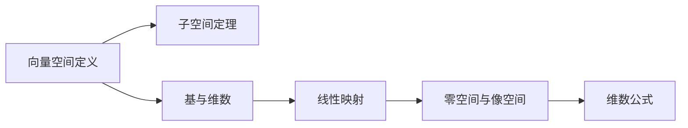

# 阶段 0 — 整书理解（数学教材增强版）

## 目标

在动手拆书之前，先**真正读懂这本数学教材**。数学书的核心是定义→定理→证明的依赖链，阶段 0 必须把这条链画出来。

产出：`books/<slug>/BOOK_OVERVIEW.md`（按 `templates/BOOK_OVERVIEW.md.template` 填充）。

## Adler 四步（保留，增强）

### 步骤 1 — 结构（Structural）

- **这本书属于哪种数学书？**（基础教材 / 专题专著 / 习题集 / 综述）
- **它的主旨用一句话说是什么？**——例如："从向量空间出发，用不含行列式的方法重建线性代数"
- **它的主要部分如何组合成一个整体？**——画出章节依赖树，用 Mermaid 格式
- **作者试图解决的核心问题是什么？**

### 步骤 2 — 解释（Interpretive）

- **关键术语**：列出反复使用的数学概念，每个给出精确定义 + 首次出现位置
- **核心命题**：用你自己的话重述书中的 5-15 个核心定理
- **论证链**：这些定理之间是怎么推导的？从哪些公理出发？

### 步骤 3 — 批判（Critical）

必须回答：
- **证明路径是否最优？**——有没有更简洁的证明？
- **有哪些缺失主题？**——作者刻意忽略了什么？
- **对哪类读者不友好？**——需要的预备知识是否过高？
- **反对意见**：如果有人要反驳这本书的证明选择，最强的论点会是什么？

### 步骤 4 — 应用潜力（Applicability）

- **哪些内容可以 skill 化？**——反复出现的证明模式、核心定理群组
- **哪些内容不适合独立 skill？**——纯计算技巧、过于基础的约定
- **预估 skill 数量**——粗略区间
- **预估优先级**——从"最常被引用"的角度排序

## 数学特有新增产出

### 新增 1：十大核心结果

全书最重要的 10 条定理，每条编号 + 一句话。这是整本书的"地标"。

格式：
```markdown
1. **定理 2.14（维数公式）**：线性映射的像空间维数 + 核空间维数 = 定义域维数
2. **定理 5.10（最小多项式与特征值）**：...
...
```

### 新增 2：预备知识清单

| 预备知识 | 需要掌握到什么程度 | 书中哪章用到 |
|---------|-----------------|------------|
| 集合论基础 | 了解集合、映射、笛卡尔积 | 第 1 章 |
| 多项式基础 | 会做多项式除法、理解因式分解 | 第 4 章 |

### 新增 3：证明路径图

Mermaid 格式的可视化，展示从哪些公理出发，经过哪些定理到达结论：



## 质量门

- [ ] 章节依赖树已画出（Mermaid 格式）
- [ ] 十大核心结果已识别（10 条，不多不少）
- [ ] 预备知识清单至少列出 5 项
- [ ] 证明路径图完整
- [ ] 批判阶段至少列出 3 条作者局限
- [ ] 已向用户展示 BOOK_OVERVIEW.md 并得到确认

## 常见失败模式

1. **跳过证明路径图**——导致后续依赖图提取器的"根部"凭空
2. **十大结果不是真正的"核心"**——选了 10 条简单的而不是重要的
3. **术语定义用口语而非数学语言**——"向量是可以移动的箭头"不精确
