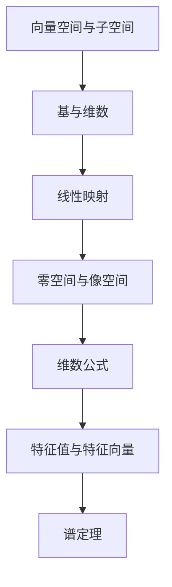

# 阶段 3 — Zettelkasten 链接（4 种数学关系）

## 目标

数学教材的链接比通用方法论书更丰富。数学定理之间存在严格的推导关系，必须用 4 种关系类型完整覆盖。

## 与通用版的差异

| 链接类型 | 通用版含义 | 数学版含义 | 示例 |
|---------|-----------|-----------|------|
| A 依赖 B | 学 A 之前最好懂 B | **学 A 之前必须先学 B** | 线性映射 → 向量空间 |
| A 使用 B | A 的论证用到 B | **A 的证明中用到 B 的结论** | 谱定理 → 线性映射基本定理 |
| A 对比 B | 两者是同一层的不同选择 | **同一概念在不同条件下的版本** | 实谱定理 vs 复谱定理 |
| A 推广 B | A 比 B 更通用 | **A 是 B 的推广** | 张量积 → 双线性型 |

## INDEX.md 内容

```markdown
# INDEX — 《线性代数应该这样学》

## 技能全景（Mermaid 依赖图）



## 技能依赖关系表

| 技能 | 前置依赖 | 使用哪个技能 | 对比哪个技能 | 推广哪个技能 |
|------|---------|-----------|-----------|-----------|
| 向量空间与子空间 | — | 基与维数 | 仿射子集 | 商空间 |
| 线性映射 | 向量空间与子空间 | 零空间 | 矩阵（等价表示） | 泛性质 |

## 目录结构

```
linear-algebra-done-right/
├── BOOK_OVERVIEW.md
├── INDEX.md                          ← 你在这里
├── 01-vector-spaces/
│   └── SKILL.md
├── 02-linear-maps/
│   └── SKILL.md
...
```

## 十大核心结果映射

| 排名 | 定理 | 所属技能 |
|------|------|---------|
| 1 | 维数公式 | 零空间与像空间 |
| 2 | 最小多项式定理 | 特征值 |
| ... | ... | ... |
```

## 学习路径推荐

| 路径 | 顺序 | 适合人群 |
|------|------|---------|
| 标准 | 第 1→2→3→4→5→...章 | 初学者 |
| 快速 | 第 1→2→5 章 | 有基础的人 |
| **应用导向** | 第 1→2→5→7→8 章（跳过抽象部分） | 工程师/数据科学 |
| 理论导向 | 全部 + 第 9-10 章（实内积空间复数化） | 数学专业 |


## 保存规则

- 当多个 skill 中的一个被删除或合并时，INDEX.md 必须同步更新
- 依赖图不能有环——存在循环依赖说明 skill 粒度不对，需要合并
